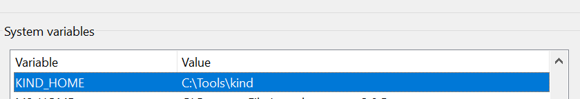
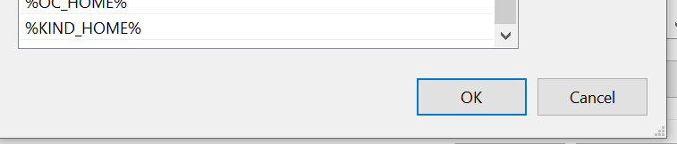

# Kubernetes 101

Session will give introduction to Kubernetes with Kind (Kubernetes in Docker). The idea is to showcase the strength of Kubernetes in a fun way.

## Installation

Install:
* Kubectl (atleast 1.25.0)
* Docker Desktop
* Kind
* Lens
--> They try to let you buy subscription but you can choose student license
* TightVNC

DISCLAIMER:
https://kind.sigs.k8s.io/docs/user/quick-start/ Install Kind (Personally did it on Windows). You can download the .exe move it to a folder that you want and then add environment variable in system settings. *Rename the file to kind.exe* to make the kind command work.



Don't forget to also add it to your `Path` environment-variable



Reboot CMD and open it as Administrator, you should be able to use the kind command.

```
C:\Users\test-user>kind version
kind v0.17.0 go1.19.2 windows/amd64
```

The following command will be often used in the following parts

```
kubectl apply -f ...
```

You can also do a delete if something is not working properly

```
kubectl delete -f ...
kind delete cluster --name k8s-cluster
```

## Prerequisites

Perform following steps before starting the demo's

```
kind create cluster --name k8s-cluster --config cluster-ingress.yaml
kubectl apply -f https://raw.githubusercontent.com/kubernetes/ingress-nginx/controller-v1.5.1/deploy/static/provider/kind/deploy.yaml
```

You should automatically get access using kubectl to the cluster.

```
C:\Users\testuser>kubectl get pods --all-namespaces
NAMESPACE            NAME                                                READY   STATUS      RESTARTS   AGE
ingress-nginx        ingress-nginx-admission-create-65klx                0/1     Completed   0          29s
ingress-nginx        ingress-nginx-admission-patch-vff69                 0/1     Completed   0          29s
ingress-nginx        ingress-nginx-controller-6bccc5966-rhf6m            0/1     Running     0          29s
kube-system          coredns-565d847f94-mn2f6                            1/1     Running     0          85s
kube-system          coredns-565d847f94-v7954                            1/1     Running     0          85s
kube-system          etcd-k8s-cluster-control-plane                      1/1     Running     0          100s
kube-system          kindnet-bt4j2                                       1/1     Running     0          85s
kube-system          kindnet-cx2wr                                       1/1     Running     0          68s
kube-system          kindnet-nsknz                                       1/1     Running     0          68s
kube-system          kube-apiserver-k8s-cluster-control-plane            1/1     Running     0          99s
kube-system          kube-controller-manager-k8s-cluster-control-plane   1/1     Running     0          101s
kube-system          kube-proxy-4p7zn                                    1/1     Running     0          68s
kube-system          kube-proxy-vchlh                                    1/1     Running     0          68s
kube-system          kube-proxy-vltqm                                    1/1     Running     0          85s
kube-system          kube-scheduler-k8s-cluster-control-plane            1/1     Running     0          101s
local-path-storage   local-path-provisioner-684f458cdd-l7d79             1/1     Running     0          85s
```

## Demo 1: Kubernetes Dashboard

Kubernetes Dashboard is a Web UI application that visualizes the resources that are running on your Kubernetes Cluster.

```
kubectl apply -f 01-dashboard\complete.yaml
kubectl -n kubernetes-dashboard create token admin-user
```

Use generated token to login on https://localhost/dashboard

## Demo 2: Rolling updates

```
kubectl apply -f 02-rollingupgrades\complete.yaml
```

This will make the version application available on https://localhost/demo/version.

Perform a rolling upgrade by executing the following command 

``` 
kubectl set image deployment/demo-version demo-version=tourna/demo:v2 -n demo-version
``` 

Refresh the page to see the new version applied.

## Demo 3: Autoscaling

```
kubectl apply -f 03-autoscaling\metrics.yaml
```

Wait until the following command returns a proper output

```
C:\Users\testuser>kubectl top nodes
NAME                        CPU(cores)   CPU%   MEMORY(bytes)   MEMORY%
k8s-cluster-control-plane   246m         3%     879Mi           7%
k8s-cluster-worker          116m         1%     444Mi           3%
k8s-cluster-worker2         603m         7%     426Mi           3%

kubectl apply -f 03-autoscaling\app.yaml
kubectl apply -f 03-autoscaling\load.yaml
```

```
oc get hpa php-apache-hpa -n demo-hpa
oc describe hpa php-apache-hpa -n demo-hpa
```

Open Kubernetes Dashboard in the meantime to see pods being created and deleted.
You can clean it up by performing following command

```
kubectl delete -f 03-autoscaling\load.yaml
```

## Demo 4: Install Kubedoom

TODO: FIX THIS IN FIRST CLUSTER

```
kind create cluster --name kubedoom --config cluster-kubedoom.yaml
```

kubectl apply -f 04-kubedoom/

User vncviewer to localhost:5900 and password is idbehold
